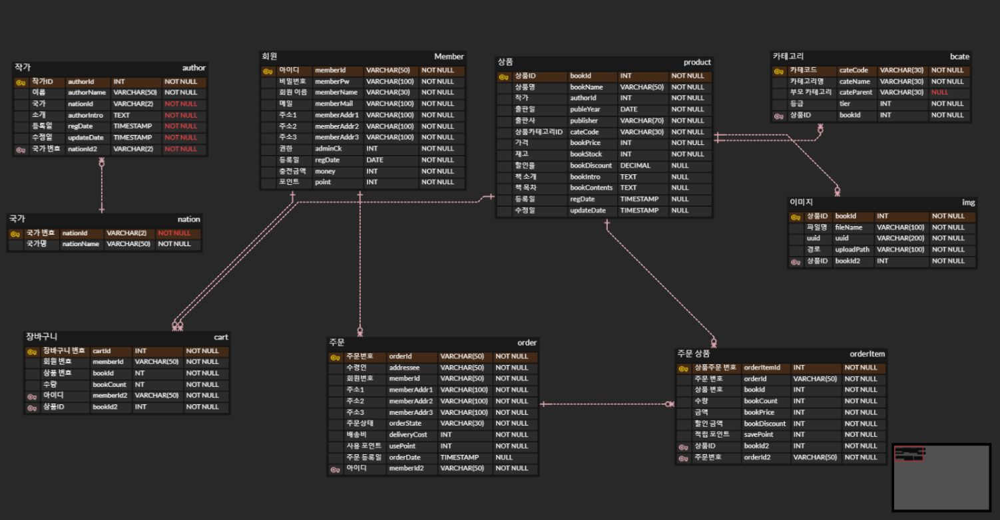
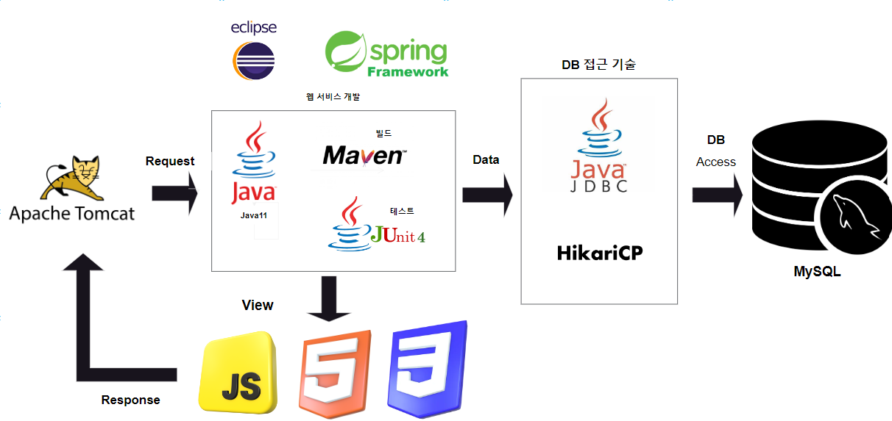
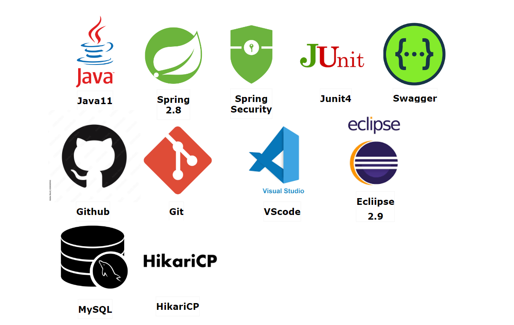

## 목차

1.[ERD 구조](#ERD-구조)  
2.[시스템 아키텍처](#시스템-아키텍처)  
3.[기술 스택](#기술-스택)  
4.[주요 기능](#주요-기능)

● 공통 : [회원가입, 로그인](#회원가입,-로그인) |  [상품 목록 및 상품상세 조회](#keyword-&-category-상품-검색)  
● 사용자 : [장바구니 관리](#장바구니-관리) | [주문 관리](#주문-관리) |    
● 관리자 : [상품 등록 및 카테고리 관리](#상품-등록-및-카테고리-관리) | [작가 관리 및 등록](#작가-관리-및-등록) | [회원 관리](#회원-관리) |
[주문 현황 관리](#주문-현황-관리) |

5.[API 명세](#API-명세)  
6.[형상 관리 - ]

# 프로젝트 소개
학원 프로젝트에서 Open API(Kakao map)을 이용한 서울시 도서관 위치를 제공해주는 기능을 개발 하였고, 더 나아가 책 주문을 할 수 있는 시스템을 구현하였습니다. 
사용자에게는 편리하게 상품을 검색 할 수 있는 편의성과 상품 구매 시, 포인트 적립 할 수 있는 기능을 구현하였습니다.
관리자에게는 시스템 관리를 위한 상품 및 작가 등록, 주문 및 회원 관리가 가능합니다. 

개발 기간 및 인원

24.01.22 ~ 24.05.   
프론트엔드 & 백엔드 1명

# ERD 구조
<a href="https://www.erdcloud.com/d/WAJG2FdSEfvFEWRGk">👉 ERD Cloud에서 직접 보기</a>

# 시스템 아키텍처

# 기술 스택

# 주요 기능
### 요약

| 공통 | 사용자   | 관리자 |
| :--- | :--- | :--- |
|  -회원가입, 로그인   | -장바구니 관리 | -상품 등록 및 상품 카테고리 관리  |
|  -상품 검색 & 카테고리 검색   | -주문 | -작가 등록 및 작가 관리  |
|  |  | -회원 관리 |
|  |  | -주문 현황 관리 | 

## [공통 기능]

### 회원가입, 로그인
● 사용자는 이메일(인증번호), 비밀번호, 주소 찾기를 이용해 회원가입을 할 수 있습니다.

● 회원가입 시 사용한 아이디와 비밀번호를 이용해 로그인할 수 있습니다.

### Keyword & category 상품 검색
● keyword 검색을 통해 상품을 조회 할 수 있습니다.
    ○ 검색을 통해 조회된 상품의 간단한 정보와 클릭 시, 상품 상세 정보를 알 수 있습니다.   
● keyword 검색을 통해 조회된 상품들은 category 별로 나누어져 있고,
    나누어진 카테고리 클릭 시, 해당 카테고리에 속한 상품 조회 됩니다.

## [사용자 기능]

### 장바구니 관리
● 장바구니에 상품을 추가한 후, 상품의 수량을 조절할 수 있고, 상품을 삭제할 수 있습니다.

● 장바구니에 담긴 상품을 체크박스로 원하는 상품이나 전체 선택하여 주문 할 수 있습니다.

● 장바구니에 담긴 상품의 가격, 배송비, 수량, 총 주문 가격이 표시 되며, 상품 추가 시, 해당 내역들이 변경되며, 마일리지 또한 동적으로 적립이 됩니다.

### 주문 관리
● 주문자의 정보(메일, 이름)와 DB에 저장된 주소가 나타나고, 직접 입력을 통해
    주소지(daum api)를 검색하여 주소를 저장할 수 있습니다.

● 주문 상품의 종류, 개수, 상품 정보, 이미지, 가격, 적립금이 나타납니다.

● 주문자의 포인트 사용 시, 할인된 가격이 최종 결제 금액에 적용되어 나타납니다.

● (마이페이지 주문 취소 예정/ 관리자 주문 취소 참고)

### 리뷰/평점 (추후 예정)

## [관리자 기능]

### 상품 괸리 
● 상품을 등록할 수 있습니다.(상품 이미지는 1장만 등록 가능.)

● 등록한 상품의 정보를 수정, 삭제할 수 있습니다.

● 상품 전체 목록을 조회 할 수 있고, 상품 하나의 정보도 조회 가능합니다.

● 상품 품절(재고, 수량) 여부를 변경할 수 있습니다.

● 상품 카테고리를 등록, 수정할 수 있습니다.

### 작가 관리
● 상품(책)의 작가 삭제, 등록(이름, 국가, 소개)을 관리할 수 있습니다.

### 주문 관리 
● 주문의 진행 여부를 확인 가능하고, 주문의 상태(취소)를 변경할 수 있습니다.

## API 명세
### <a href="http://localhost:8080/swagger-ui.html#/">⬆️ API 명세 보기(SWAGGER-ui.html)</a>
|  Domain  | URL  | Http Method  | Description  | Access  |
|:--:| :--- | :--:  | :--:  | :--: |
|  Member  | /member/join | 회원가입 | POST | - |
|          | /member/login| 로그인   | POST | - |
|          | /member/mailCheck       | 이메일 인증       | GET | - |
|          | /member/memberIdChk     | 아이디 중복 검사   | POST | - |
|          | /admin/logout.do        | 비동기식 로그아웃  | POST | ADMIN |
|  author  | /admin/authorDelete     | 작가 정보 삭제   | POST/DELETE | ADMIN |
|          | /admin/authorDetail     | 작가 상세/수정 페이지 | GET/PATCH | ADMIN |
|          | /admin/authorEnroll.do  | 작가 등록 | POST | ADMIN |
|          | /admin/authorManage     | 작가 관리 접속 | GET | ADMIN |
|          | /admin/authorModify     | 작가 정보 수정 | POST/PATCH | ADMIN |
|          | /admin/authorPop        | 작가 팝업 창   | GET | ADMIN |
|  Book    | /book/display        | 이미지 출력  | GET | - |
|          | /book/getAttachList  | 이미지 정보 반환 | GET | - |
|          | /book/goodsDetail/{bookId} | 상품 상세 | GET | - |
|          | /book/search         | 상품 검색 | GET | - |
|          | /admin/deleteFile    | 이미지 파일 삭제 | POST/DELETE | - |
|          | /admin/uploadAjaxAction | 첨부 파일 업로드 | POST | ADMIN  |
|          | /admin/goodsDelete   | 상품 정보 삭제 | POST/DELETE  | ADMIN  |
|          | /admin/goodsDetail   | 상품 조회/수정 | GET/PATCH | ADMIN |
|          | /admin/goodsModify   | 상품 정보 수정  | POST/PATCH | ADMIN |
|          | /admin/goodsEnroll   | 상품 등록  | POST | ADMIN |
|          | /admin/goodsManage   | 상품 관리  | GET  | ADMIN |
|  Cart    | /cart/{memberId}     | 장바구니 정보 리스트 | GET | - |
|          | /cart/add            | 장바구니 등록  | POST | - |
|          | /cart/delet          | 장바구니 삭제  | POST/DELETE | - |
|          | /cart/update         | 장바구니 수량 수정  | POST/PATCH | - |
|  Order   | /order              | 상품 주문 처리    | POST | - |
|          | /order/{memberId}   | 상품 주문 페이지  | GET | - |
|          | /order/check        | 상품 주문 확인    | POST | - |
|          | /admin/orderCancel  | 주문 취소 | POST | ADMIN |
|          | /admin/orderList    | 주문 현황 | GET  | ADMIN |

# 프로젝트를 통해 배운점
이걸 통해서 무엇을 배웠고,

이런 것, 저런 것을 개발 해보았어요를 한 줄로 요약하고, 

개발을 하면서 이런 문제를 겪었는데, 이렇게 해결했어요.

